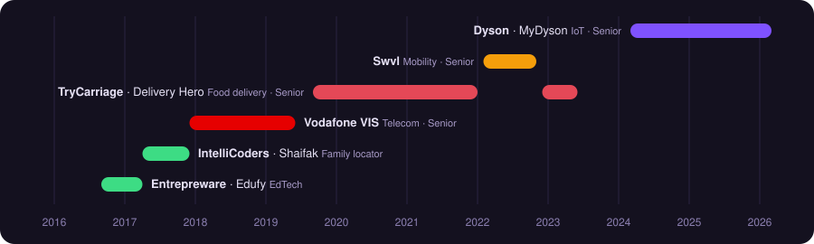

  

  
  
  
  
  
  

Senior Android Engineer building consumer products at scale across IoT, food delivery, mobility and telecom. Most recently part of the team behind MyDyson, Dyson’s smart-home app used by millions worldwide, with end-to-end ownership from architecture through release. Specialised in Kotlin, Jetpack Compose and Coroutines, and expanding into Kotlin Multiplatform with a growing focus on technical leadership.

## 🧭 Career

<b>Senior Android Engineer @ Dyson</b> · Mar 2024 - Mar 2026 · <i>Smart-home technology and IoT devices - MyDyson app (5M+ downloads).</i>

- Optimised IoT connectivity logic (MQTT, BLE), improving device communication stability and reliability.
- Implemented Android-side Matter support for Dyson products: Matter MQTT messaging, dynamic topic subscriptions, onboarding payload generation and PAKE/verifier logic, plus the engineering UI for commissioning and debug flows.
- On joining a new team, led the migration of the UI test suite that enabled the release of the new Global Navigation UI to over 5 million MyDyson users; then led the post-launch cleanup, retiring legacy activities, menus and feature-toggle plumbing, and fixing deep links and navigation regressions, leaving the codebase free of technical debt.
- Led the Android implementation and delivery of three major features on the 2D map, Target Area, Rules and Furniture for the Dyson Spot+Scrub AI robot, giving users a smooth, responsive way to manage cleaning areas.
- Built the first stage of an Kotlin Multiplatform logging library at Dyson, delivering HTTP API-call logging, with a design extensible to MQTT and BLE, to streamline log capture and sharing across QA, app, backend and embedded teams.

<b>Senior Android Developer @ TryCarriage (Delivery Hero)</b> · Sep 2019 - Jan 2022 | Dec 2022 - Jun 2023 · <i>Food-delivery platform operating in Qatar.</i>

- Introduced a dynamic-features mechanism enabling faster build delivery and A/B testing.
- Delivered the new search UI feature while maintaining the existing backend API contract.

<b>Senior Android Developer @ Swvl</b> · Feb 2022 - Nov 2022 · <i>Mass-transit and mobility technology.</i>

- Refactored the base MVIViewModel to migrate from Channels and RxJava to Kotlin Flow, with minimal changes to consuming code.
- Contributed to a B2B-focused team, improving the white-labelling process to deliver branded apps faster to Swvl’s partners.
- Delivered B2B features in partnership with Shotl, keeping the codebase aligned with Swvl’s coding standards.

<b>Senior Android Developer @ Vodafone - VIS</b> · Dec 2017 - Jun 2019 · <i>Global telecommunications group.</i>

- Delivered the domain-layer code for the Postpaid screen, designed to scale to complex UI while orchestrating more than seven API calls.
- Optimised the Clean Architecture base classes, UseCase abstractions, error handling and RxJava streams.

<b>Junior Android Developer @ IntelliCoders</b> · Apr 2017 - Dec 2017 · <i>Family-locator startup.</i>

- Built the Shaifak family-locator app from scratch for the Egyptian market.
- Used Firebase Realtime Database for live location tracking and instant updates.

<b>Junior Android Developer @ Entrepreware</b> · Sep 2016 - Apr 2017 · <i>Education-management system for schools.</i>

- Built the Edufy app from scratch, used by teachers to update student reports.
- Introduced MVP architecture to separate business logic from UI.

## 🛠 Stack

  

| | |
|---|---|
| **Language & async** |      |
| **UI** |    |
| **Architecture** |    |
| **IoT & platform** |      |
| **Delivery** |      |

## 🔭 Featured

<a href="https://github.com/mibrahimdev/Sharingan">
  <picture>
    <source media="(prefers-color-scheme: dark)" srcset="https://github-readme-stats.vercel.app/api/pin/?username=mibrahimdev&repo=Sharingan&hide_border=true&bg_color=0d1117&title_color=a37aff&icon_color=8755e6&text_color=e6edf3" />
    
  </picture>
</a>

## ✍️ Writing & mentoring

<!-- BLOG-POST-LIST:START -->
- [Kotlin Gems: the reified keyword](https://mibrahimdev.github.io/reified-keyword/)
- [Kotlin Gems: infix functions](https://mibrahimdev.github.io/infix-operator/)
- [Kotlin Gems: crossinline functions](https://mibrahimdev.github.io/crossinline-functions/)
- [Kotlin Gems: inline &amp;amp; noinline functions](https://mibrahimdev.github.io/inline-noinline-functions/)
- [Kotlin Gems: Delegated Properties](https://mibrahimdev.github.io/delegated-properties/)
<!-- BLOG-POST-LIST:END -->

→ [All articles](https://mibrahimdev.github.io/blog/) · [Videos](https://mibrahimdev.github.io/videos/)

🎓 Android mentor on ADPList, 50+ sessions with developers from students to senior engineers, rated 100% for communication, problem-solving and subject knowledge across 17 reviews.

Udacity Android Developer Nanodegree · BSc Electrical Engineering (Electronics & Communication), Aswan University
